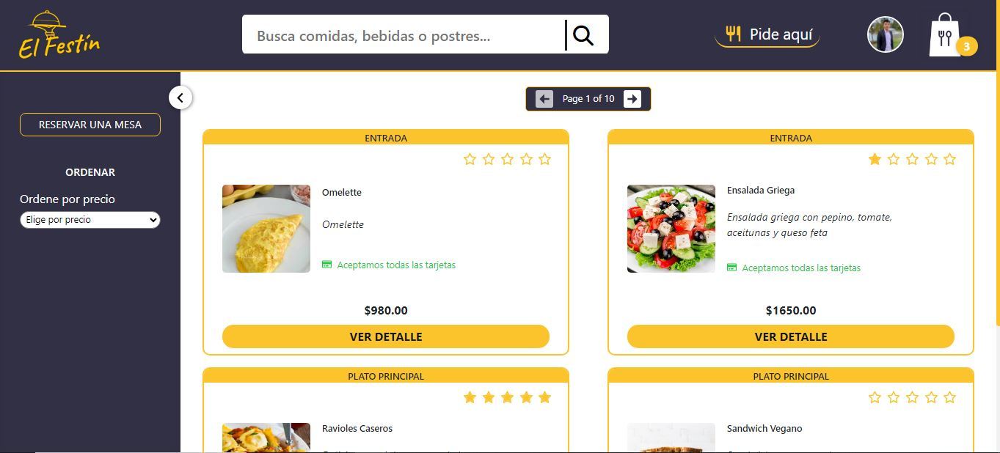
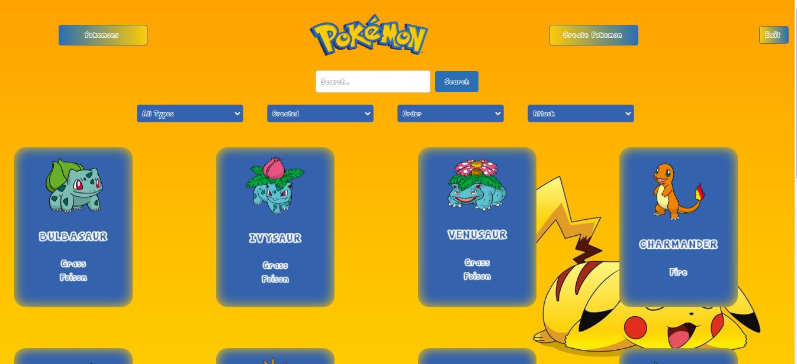
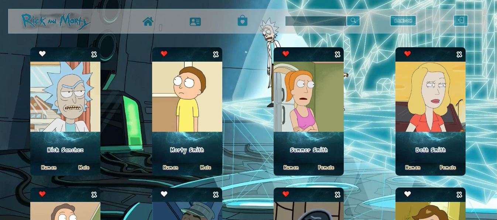

# 💫 Acerca de Mí:

¡Hola! 👋 Soy un Desarrollador Full-Stack graduado de Henry, con formación en Ingeniería Industrial y Tecnología de las Telecomunicaciones. Mi trayectoria demuestra mi capacidad para adaptarme y mejorar constantemente en el ámbito tecnológico.  Apasionado desarrollador de aplicaciones web con un enfoque en la creación de experiencias digitales impactantes. Mi entusiasmo por la programación se fusiona con la creatividad para diseñar soluciones que ofrecen experiencias de usuario intuitivas y envolventes. Siempre en la búsqueda de desafíos y oportunidades para brindar soluciones innovadoras y efectivas.

# 💻 Tecnolgias:

FrontEnd: React | Redux | HTML | CSS  
BackEnd: Node | Express | JavaScript  
Database: PostgreSQL | Sequelize  

      

## 📌 My projects:
Aplicación el Festín online (Proyecto final Henry)  
   
Aplicación Pokemón (Proyecto individual Henry)  
  
Aplicación Pokemón (Proyecto integrador Henry)  

## 🌐 Contacto:

📧 Correo: fabiandmz13@gmail.com  
📂 Portafolio: https://fabiandom-portfolio.vercel.app/

